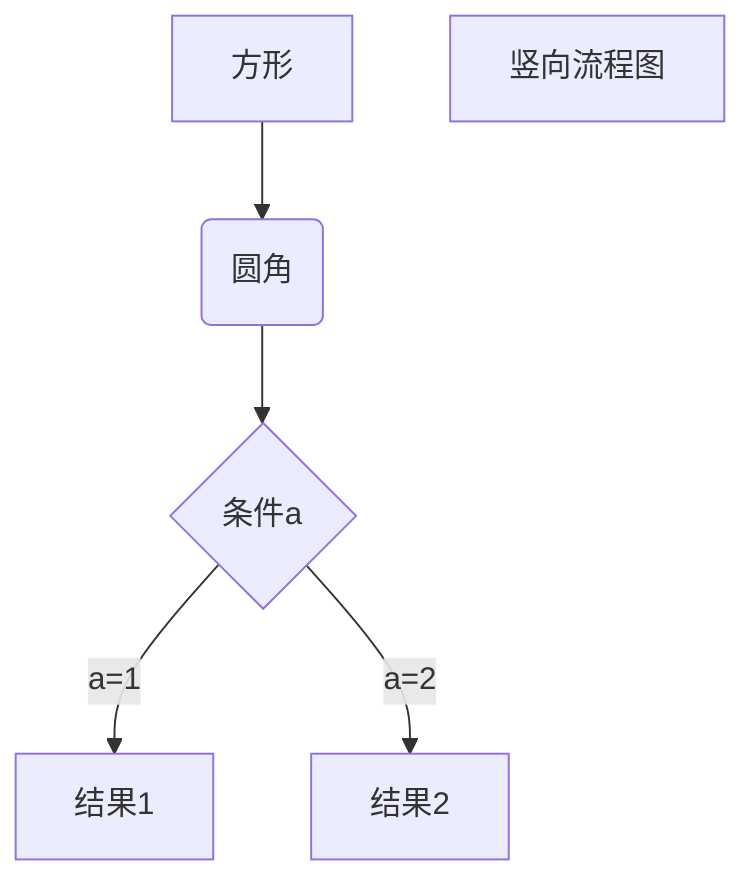

***此项目的内容主要是照抄或者参考了：[同济子豪兄](https://space.bilibili.com/1900783/#/)<br>***

---  
#### 在VSCode 中创建 Python venv环境
```python
1. (cmd + shift + p), 搜索 Python: Create Environment，选择python版本，vscode将开始自动创建venv
   python3 -m venv .venv # 手动创建venv
2. 激活venv, (cmd + shift + p)，搜索 python: Select Interpreter
   ** 若无法自动激活(例如使用了power shell)，则手动激活： 
   .\.venv\Srcipts\active.bat # windows
   source .venv/bin/activate # linux
3. 激活venv后，使用pip安装依赖包: 
   pip install <package_name> 
     or pip install -r requirement.txt(若有此文件)
     or /Users/jupiter/16.vscode-workspace/jupyter-study/.venv/bin/pip install <package> # e.g.: scikit-learn
4. 查看已安装列表: 
    pip list
5. deactivate #退出venv
6. 生成依赖列表
   pip freeze > requirement.txt
```
---  

#### 删除当前目录的git信息，并重建git仓库
```shell
1. git status # 查看信息
   git remote -v # 查看远程信息
   git branch # 查看分支信息
   git log # 查看历史提交信息
  # 非git仓库时: 
  fatal: not a git repository (or any of the parent directories): .git
2. rm -rf .git # 删除当前目录的git信息
3. rm -f .gitignore .gitattributes # 删除git配置文件(若有)
4. git init # 重新初始化git
5. git status # 验证git状态
6. git add . # stages all files in the current directory
7. git commit -m "Initial commit" # commit
8. # before push to remote repository, should create remote URL first
   # the remote URL looks like this.   
   GitHub HTTPS: https://github.com/linguiben/jupyter-study.git
   GitHub SSH: git@github.com:linguiben/jupyter-study.git
   git remote add origin <remote-url>
9. # push to remote branch (usually main or master))
   git push -u origin main
10. # in the future, can just run
   git push
   
jupiter@Jupiter-Mac jupyter-study$git push -u origin main
remote: Repository not found.
fatal: repository 'https://github.com/linguiben/jupyter-study.git/' not found
```


```shell
# Recreate a virtual environment in the current directory
cd /Users/jupiter/16.vscode-workspace/jupyter-study
py --version # check and confirm python version first
py -m venv .venv
source .venv/bin/activate

# reinstall dependencies
# from requirements.txt
pip install -U pip
pip install -r requirements.txt

# verify
which python
python -V
pip list

## Optional
pip install pandas # install pandas
pip show pandas # show pandas version
pip install jupyter # install jupyter notebook
#jupyter notebook # start jupyter notebook
pip freeze > requirements.txt # (lock dependencies)

```

---  

## Markdown语法
#### ####四级级标题  

[链接](http://vscode.github.net.cn/docs/python/environments)  


`one line code`  
$y=ax + b$  
$$y=ax + b$$  
这是爱因斯坦的只能方程$E = mc^2$，用于表示质能转换。
$$一元二次方程的解： x = \frac{-b\pm \sqrt{b^2-4ac}}{2a}$$  

*斜体*  
**粗体**  
***粗斜体***  
~~删除线~~  
<u>带下划线文本</u>  

1. 列表1  
2. 列表2  
    * 列表3  
    * 列表4  
        * 列表5  

| 标题1 | 标题2 | 标题3  |
|-----| --- |------|
| 1   | 2   | 3    |
| a   | b | c    |

>  引用一
> >  引用二
> > >  引用三

---  
<span style="color: red"> 红色高亮 </span>  
使用 <kbd>Ctrl</kbd>+<kbd>Alt</kbd>+<kbd>Del</kbd> 重启电脑  
* [x] 任务一  
<mark>高亮文本</mark>  
&#x1F602;  
&#x2702;

---  
[<u>Markdown 高级技巧-程图等</u>](https://www.runoob.com/markdown/md-advance.html)



[1]: http://vscode.github.net.cn/docs/python/environments
